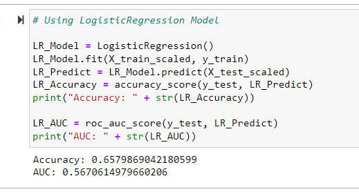
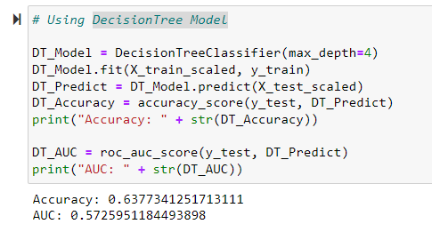
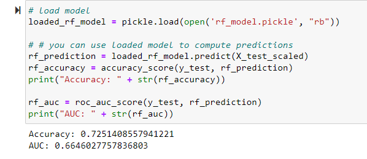

# Project 4. Predicting Music Popularity.

## Presentation
Link to Presentation: https://docs.google.com/presentation/d/1Xeg26N8SX3Ojknuxh6DrVOvTNKtV6Y3aHUwz3OcZMTY/edit#slide=id.ga073618e60_0_106

## Report

### Overview

The overview of this project is to use machine learning to create model that can predict whether a music is likely to be popular after production.

### Result

- Data Preprocessing

  - The target variable for the model is "track_popularity" column
  - The features variable for this model are
    - danceability
    - energy
    - key
    - loudness
    - mode
    - speechiness
    - acousticness
    * instrumentalness
    * liveness
    * valence
    * tempo
    * duration_ms
    * genre

  * The variables that are removed are track_album_id, track_album_name, track_album_release_date, playlist_name, playlist_id, track_id, playlist_subgenre, track_name, track_artist.

### Compiling, Training, and Evaluating the Model

- The data was standardized using Standard scaler, Logistic Regression Model was use to train our data and the accuracy was 65.8% which is considered to be very low.
  

* An esemble model was used on the previous weak model to get an optimized model, A DecisionTree Model was used and resulted in 63.7% before A RandomForestClassifier Model was used and an accuracy of 72.5% was achived.
   

### Summary

- The model was able to predict an outcome with 72.5% accuracy. Though the accuracy is below 75% but it can still be considered as a good model. All the model used and the data can be found in DataProcessing folder.
  

* A web form is used to collect input to test our model and the result is also displayed through the same web application.Every component of the web application can be found inside the Frontend/Backend folder.
